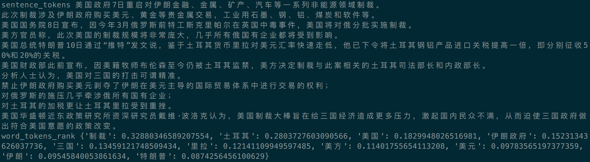

自然语言处理是机器学习和数据科学的一个领域，涉及处理，解释或生成自然人类语言。这是一个很大的主题，从生成摘要或检测意图/情绪到从数据生成内容。

## 我们正在建设什么

我们将构建一个基于单词频率评分工作的天真摘要生成器。我们将利用这个pyltp和jieb的Python库来构建我们的管道。

我们还将利用ArgparsePython模块创建命令行程序作为摘要器的入口点。

## 先决条件

本文做出以下假设：

你熟悉Python

本代码利用Python 3.5或更高版本

## Simple-Chinese-Summarizer如何运作

我们将实施的频率评分系统就是这样。

获取中文文本 - 输入中文的文件路径，读取文本。

执行格式化和清理 - 格式化并清理我们的格式，以便它没有额外的空白区域或其他问题。

标记输入 - 获取输入并将其分解为单个单词。

评分 - 基于 TF-IDF 算法的提取关键词和评分， 再对每个句子根据关键字分数取合进行评分（计数）。

选择 - 根据他们的分数选择前N个句子。

## 源输入

对于文章中的示例代码，我将使用
http://news.cctv.com/2018/08/14/ARTId7vb9OqUJvNpTjn6XvD1180814.shtml中的段落---美国出招精准打击

您可以在下边链接下载此文本的格式化副本下载
https://github.com/xiaoyaosheng/Simple-Chinese-Summarizer/blob/master/data/Precision-Strike-In-The-Us.txt

## 完整的源代码

整个代码在GitHub上提供。

https://github.com/xiaoyaosheng/Simple-Chinese-Summarizer/

### 可选 - 设置Virtualenv

Virtualenv是一个Python库，允许您创建虚拟Python环境并避免使用共享库版本控制。此步骤不是必需的，但非常推荐。

## 项目设置

让我们开始创建文件夹结构。如果您决定使用Virtualenv，请确保--python在使用Python 3.6之外的版本时更新标志。

$ mkdir Simple-Chinese-Summarizer && cd Simple-Chinese-Summarizer
$ virtualenv venv --python = python3.6

$ source venv / bin / activate

$ mkdir data

$ mkdir Summarizer

我已将上述故事放在数据data目录中Precision-Strike-In-The-Us.txt作为其文件名。

接下来，使用以下内容SummarizerForChinese在Summarizer目录中创建文件：

   	import argparse
	import argparse
   	from heapq import nlargest
	from collections import defaultdict
	from pyltp import SentenceSplitter
	import jieba.analyse
	def main():
		print("Hello world")

	if __name__ == "__main__":
		print(main())

### 安装ieba

首先安装带有Pip的ieba模块。

 	$ pip install jieba==0.39

	$ python Summarizer / SummarizerForChinese.py

	Hello world

## Argparse和命令行函数

Argparse是一个内置的Python模块，可以在Python 3版本中使用。它可以用来使命令行应用程序的处理函数，标志和帮助更容易。这是Python是我最喜欢的命令行应用语言的原因之一。

	def main():
		args = parse_arguments()
		print(args)

	def parse_arguments():
 		parser = argparse.ArgumentParser()
		parser.add_argument('filepath', help='File name of text to summarize')
		parser.add_argument('-l', '--length', default=4,help='Number of sentences to return')
		args = parser.parse_args()
	return args

首先，请注意main我们现在调用的函数parse_arguments()并将结果存储到args变量中。

我不会深入研究Argparse模块，但上面的代码演示了如何使用参数解析器注册某些命令，例如name，help语句或默认值。

由于第7行的第一行不包含连字符，因此它是命名的有序参数，而第8行的第二行是注册标志值的示例。

您可以在此处阅读Argparse的官方文档以获取更多信息。

https://docs.python.org/3/library/argparse.html

当您重新运行文件（包括新的filepath命令）时，输出应类似于：

	(venv) $ python Summarizer/SummarizerForChinese.py

	usage: SummarizerForChinese.py [-h] [-l LENGTH] filepath

	SummarizerForChinese.py: error: the following arguments are required: filepath

	(venv) $ python Summarizer/SummarizerForChinese.py data/Precision-Strike-In-The-Us.txt

	Namespace(filepath='data/Precision-Strike-In-The-Us.txt', length=4)

这意味着我们现在可以继续阅读文件了。

## 代码解释
### 第1步。阅读内容

我们将编写一个函数read_file，它负责接受文件路径并将整个内容返回到内存中，或者如果找不到文件或没有读取权限则输出错误。

	def main():
		args = parse_arguments()
		content = read_file(args.filepath)
		print(content)

	def read_file(path):
		try:
			with open(path, 'r') as file:
				return file.read()

		except IOError as e:
			print("Fatal Error: File ({}) could not be located or is not readable.".format(path))

请注意，我们还在函数中添加了对新函数的main调用，并将响应（我们的文件内容）存储到变量中content，然后在下一行输出。

如果在运行SummarizerForChinese.py脚本时在终端中获取文本文件的原始数据，则新添加的代码全部正常工作。

### 第2步。数据清理

我读到的关于数据科学和机器学习的大多数事情都表明，80％的时间花在了数据清理，收集和规范化上。这就是我们在数据文本文件中留下空格的原因，因此我们可以查看清理这些数据的原因。

 	def main():
		args = parse_arguments()

		content = read_file(args.filepath)
		content = sanitize_input(content)
		print(content)

	def sanitize_input(data):
		replace = {
			ord('\f') : ' ',
          ord('\t') : ' ',
          ord('\n') : ' ',
          ord('\r') : None
      }

    return data.translate(replace)

该sanitize_input命令转换我们想要剥离的不同空格和换行符，并用于String.translate执行此操作。我们的目标是在结束标点符号后替换除一个空格之外的任何额外空白字符。

SummarizerForChinese.py再次运行，您应该看到我们上次测试中没有空白区域的信息。

### 第3步。标记

既然我们的内容很干净且准备就绪，我们可以通过将文本分解为句子和提取关键词和权重。

	def main():

		args = parse_arguments()

    	content = read_file(args.filepath)

    	content = sanitize_input(content)

    	sentence_tokens, word_tokens_rank = tokenize_content(content)

		sentence_tokens, word_tokens_rank = tokenize_content(content)
		print('sentence_tokens','\n'.join(sentence_tokens))
		print('word_tokens_rank',word_tokens_rank)

	def tokenize_content(content):

		jieba.analyse.set_stop_words("data/stop_words.txt")

    	tags = jieba.analyse.extract_tags(content, topK=10, withWeight=True)

    	word_tokens_rank = dict()

    	for tag in tags:
        	word_tokens_rank[tag[0]] = tag[1]
		return [
				SentenceSplitter.split(content),
				word_tokens_rank
			    ]

返回的两个结果：
>第一个是整个文本分出的句子列表，利用pylt的SentenceSplitter来处理。

>第二个返回是关键词和权重组成的字典,利用jieba的extract_tags来处理。

利用jieba来去停止词，and或者or或者了、和这样的等等。我们不希望对最终摘要的句子评分产生影响。因此，利用jieba调用data目录下的stop_words.txt来去除，stop_words.tx下面可以添加自己希望增加的停用词。

  

### 第4步。评分

我们现在有分出来的句子列表以及一个单词和权重组成的字典，因此我们可以用关键词及权重进行评分，并使用它来对我们的句子进行评分。

	def score_tokens(words_tokens_rank,sentence_tokens):

		ranking = defaultdict(int)

    	for i, sentence in enumerate(sentence_tokens):

			for word in jieba.cut(sentence.lower(), cut_all=False):  # 精确模式

				if word in words_tokens_rank:

					ranking[i] += words_tokens_rank[word]

		return ranking

我们初始化一个defaultdict（一个用于制作你自己的频率图的一个很好的结构），我们迭代句子并根据words_tokens_rank变量中特定单词的频率增加他们的分数。

然后，排名值将包含句子的序号及其得分。SummarizerForChinese.py脚本的输出现在应该如下所示。

	(venv) $ python Summarizer/SummarizerForChinese.py data/Precision-Strike-In-The-Us.txt

defaultdict(<class 'int'>, {0: 0.42426186643069186, 1: 0.5789525541262265, 2: 0.5117982685437736, 3: 0.6258158250849057, 4: 0.952577068375849, 5: 1.0035665430513208, 6: 0.31758602013679244, 7: 0.44344314074654084, 9: 0.6821566201140881, 10: 1.1469703088173584})

### 第5步。选择

现在评分已经完成，我们最终可以从N个最高评分句子中构建我们的总结，其中N是我们期望的长度。

	def summarize(ranks, sentences, length):

		if int(length) > len(sentences):
			print("Error, more sentences requested than available. Use --l (--length) flag to adjust.")
			exit()

		indexes = nlargest(length, ranks, key=ranks.get)
		final_sentences = [sentences[j] for j in sorted(indexes)]
		return ' '.join(final_sentences)

>sentence_ranks：使用我们的评分函数传递我们生成的字典sentence_tokens变量中唯一句子的列表
args.length表示的摘要的长度，如果在启动时未提供值，则默认值为4。

要求的长度是否不超过可用的句子总数。如果是，我们就会出错。

该nlargest函数由heapq提供，并获取权重前n个数据和索引，并将其转换为sentence_tokens变量中句子的数字位置列表。

然后，我们在列表压缩中使用此索引列表，将我们的标记化列表中的每个句子放入我们的最终摘要中。我们使用sorted()对索引列表进行排序，以便我们的句子以有机顺序出现。最后，这些值连接在一起成为一个字符串并返回。

### 最后的总结

继续运行SummarizerForChinese.py脚本最后一次，你应该得到一个与这个相同的摘要：

	美国总统特朗普10日通过“推特”发文说，鉴于土耳其货币里拉对美元汇率快速走低，他已下令将土耳其钢铝产品进口关税提高一倍，即分别征收50%和20%的关税。 美国财政部此前宣布，因美籍牧师布伦森至今仍被土耳其监禁，美方决定制裁与此案相关的土耳其司法部长和内政部长。 对土耳其的加税更让土耳其里拉受到重挫。 美国华盛顿近东政策研究所资深研究员戴维·波洛克认为，美国制裁大棒旨在给三国经济造成更多压力，激起国内民众不满，从而迫使三国政府做出符合美国意愿的政策改变。

## 结论

感谢您花时间阅读这篇文章。我希望你对Python中的自然语言处理感觉更舒服，甚至可能有一些想法如何使代码更好。